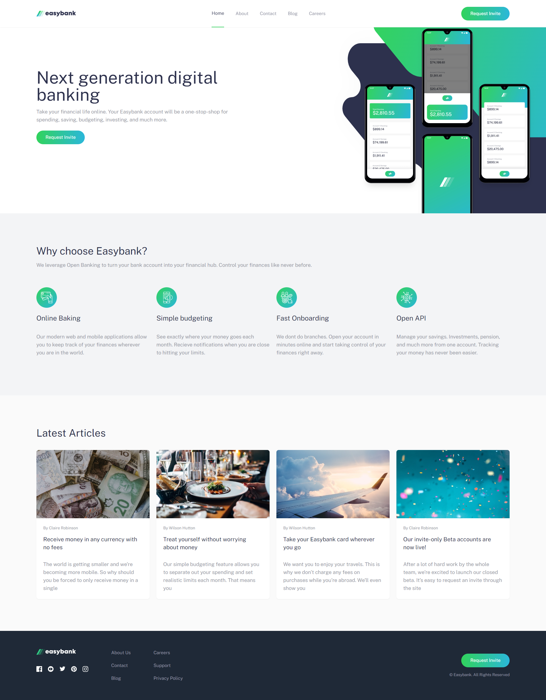

## Table of contents

- [Overview](#overview)
  - [The challenge](#the-challenge)
  - [Screenshot](#screenshot)
  - [Links](#links)
- [My process](#my-process)
  - [Built with](#built-with)
  - [What I learned](#what-i-learned)
  - [Continued development](#continued-development)
  - [Useful resources](#useful-resources)

## Overview

### The challenge

Users should be able to:

- View the optimal layout for the site depending on their device's screen size
- See hover states for all interactive elements on the page

### Screenshot

### Links

- Live Site URL: [Vercel URL](https://bank-landing-page-theta.vercel.app/)

## My process

### Built with

- Semantic HTML5 markup
- CSS custom properties
- Flexbox
- CSS Grid
- Mobile-first workflow
- Responsive design
- TypeScript
- [React](https://reactjs.org/) - JS library
- [React Hooks](https://es.react.dev/reference/react/hooks) 
- [Tailwind](https://tailwindcss.com/docs/installation) - For styles

## What I Learned

### React with TypeScript

- **Componentization**: I learned to break down the user interface into reusable components, making the codebase more maintainable and scalable.
- **Static Typing**: I utilized TypeScript to improve code safety through static typing, helping to catch errors early and ensuring a more robust codebase.

### Tailwind CSS

- **Utility-First Styling**: Adopted the utility-first methodology of Tailwind CSS, allowing for quick and efficient styling directly in the HTML.
- **Responsive Design**: Implemented responsive design using Tailwind CSS breakpoints, ensuring the application looks good on mobile devices, tablets, and desktops.

### State Management with React Hooks

- **useState**: Used the `useState` hook to manage the state of the menu options, enabling the application to be interactive and responsive to user actions.

### Mobile-First Design

- **Prioritizing Mobile Devices**: Learned to design with a mobile-first approach, ensuring an optimal user experience on smaller screens and scaling the design up for larger screens.

### React with Tailwind

- **Tool Integration**: Learned to combine React and Tailwind CSS to create modern and responsive user interfaces efficiently.

### Developing Specific Components

- **Navbar with Hamburger Menu**: Developed a responsive navbar component that adapts to different screen sizes, displaying a hamburger menu on mobile devices.
- **Modal for the Menu**: Implemented a modal for the menu on mobile devices, enhancing the user experience.

### Optimization and Accessibility

- **Using z-index**: Learned to correctly use z-index to manage the layering of elements in the interface.
- **Accessibility Considerations**: Considered accessibility aspects when designing interactive components, ensuring the application is usable by a wider audience.

### Best Practices

- **Documentation and Structure**: Improved my ability to document the code and structure a React with TypeScript project in an organized manner.
- **Using Git**: Used Git for version control, improving change management and collaboration on the project.

### Continued development
Moving forward, I aim to further enhance my skills in the following areas:

- **Advanced State Management:** While I've started using useState and useEffect effectively, I want to explore more complex state management solutions like useReducer and custom hooks to streamline state logic in larger applications.

- **Optimizing Performance:** I plan to dive deeper into React's performance optimization techniques, including memoization, useCallback, and useMemo hooks, to ensure smooth and efficient rendering of components, especially in data-intensive applications.

- **Enhancing Responsive Design:** While I successfully implemented responsive design principles in this project using Tailwind CSS, I want to refine my skills in handling more intricate layouts and ensuring a seamless user experience across various devices and screen sizes.

- **Exploring TypeScript Further:** Although I incorporated TypeScript in this project for type safety and better code readability, I aim to deepen my understanding of TypeScript's advanced features and integration with React to leverage its full potential in future projects.

These areas represent my ongoing commitment to continuous learning and improvement in my development journey.

### Useful resources

This section includes links to resources that were valuable during the development process or that you found helpful for learning new concepts.

- [MDN Web Docs](https://developer.mozilla.org/en-US/docs/Web) - A comprehensive resource for web development topics, including HTML, CSS, and JavaScript. It's my go-to reference for understanding browser APIs and best practices.

- [Tailwind CSS Documentation](https://tailwindcss.com/docs) - The official documentation for Tailwind CSS. It provides detailed explanations and examples for using Tailwind's utility-first approach to styling.

- [React Hook Documentation](https://es.react.dev/reference/react/hooks) - TThe official React documentation on hooks provides clear explanations and examples for useState, useEffect, useContext, and other hooks. It's an essential resource for mastering React's functional components and state management.

- [UseHooks](https://usehooks.com/) - A collection of custom React hooks covering a wide range of use cases. Each hook comes with detailed explanations and practical examples, making it easier to integrate custom hooks into your projects.

